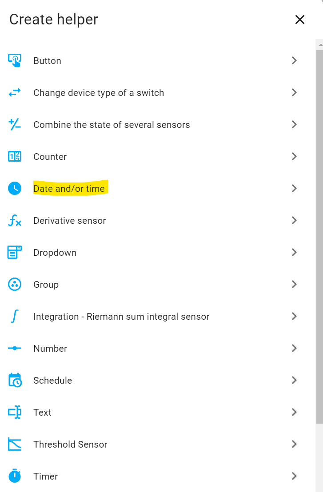
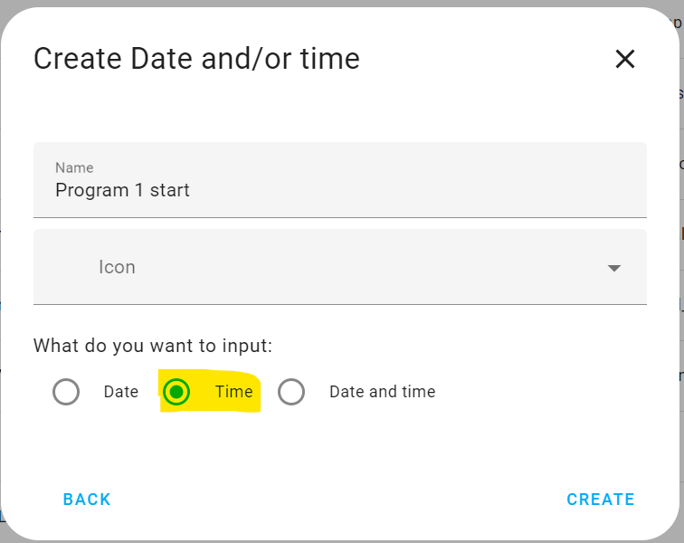
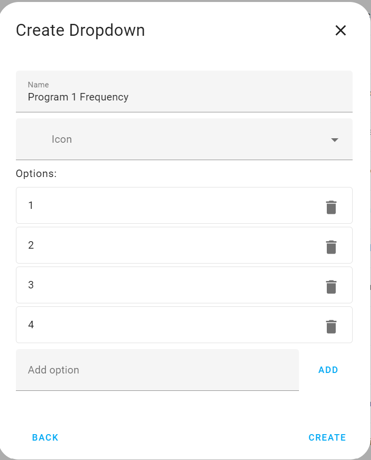
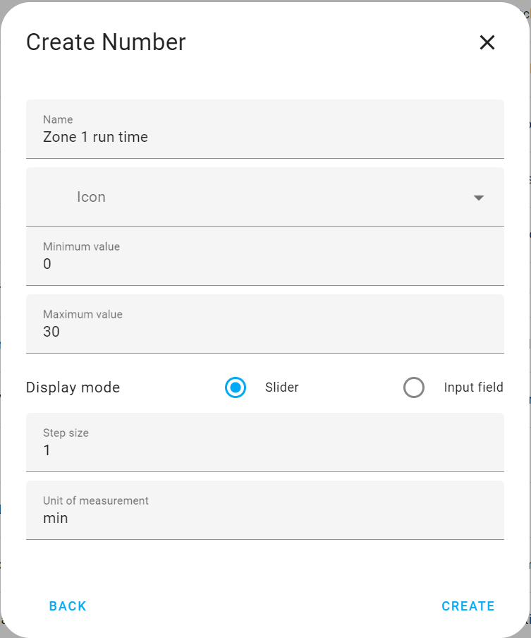
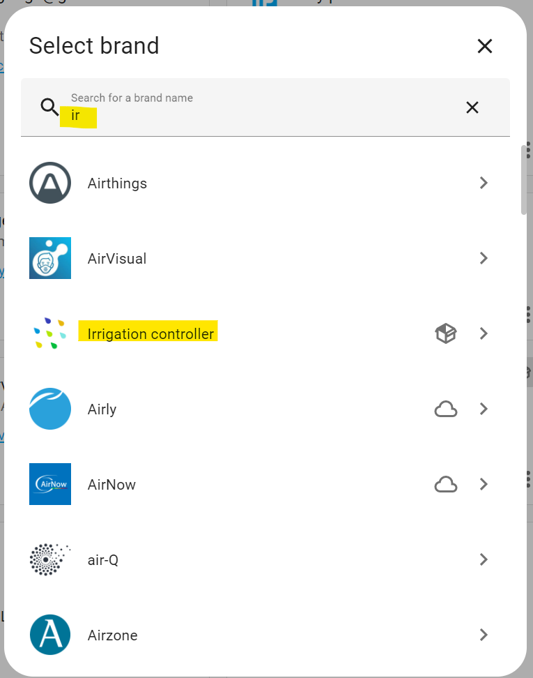
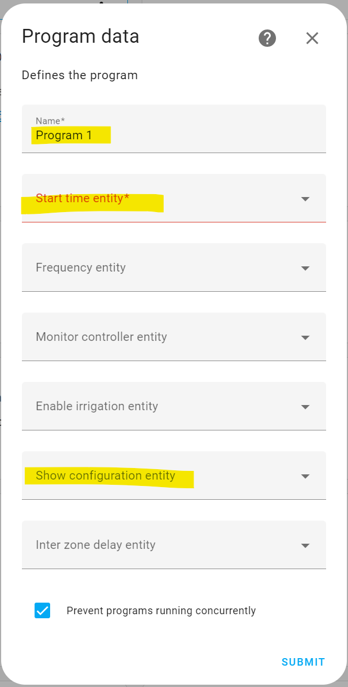
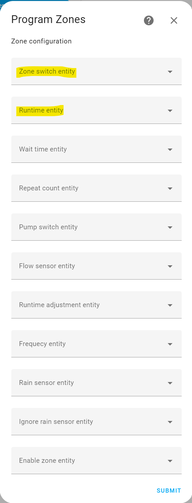

I will assume:
- you have installed from HACS the latest versions of both the custom control and the custom card.
- you have solenoids that are exposed in home assistant as switches.


I hope this gets you over the line. Feel free to reach out if you have any questions.

So here we go:
## Custom Component
Go to settings/devices and services/helpers. here we will create the basic helper items that will allow the program to be configured. Choose the create helper button



Add a 'Date and/or time' helper with this configuration



Add a 'Dropdown' helper



this config will allow you to run every day to every 4 days, you can also add 'Off' as an option to prevent the program from running.

Now an 'Number' Helper to specify how long a zone will run for, you will need one for each zone.



This is enough to define a program and a zone.

I would recommend that you also create a 'Toggle' helper to support the hiding of the configuration in the custom card.

Now go to settings/devices and services/integrations

select Add Integration, start typing 'irrigation' and then select irrigation controller



Complete the form selecting the helpers you created earlier and then submit



Now configure the zone definition



The Zone Switch is the switch entity that triggers your zone solenoid
the runtime is the input number helper created earlier. Submit the form

From thisnext page you can add more zones or apply the changes. 

Once you have applied the changes you will have a new switch available.

## Custom Card

Now lets add the custom card

On your Home Assistant page open the dashboard menu, the three dots top right, choose Edit dashboard.

select ADD CARD, scroll to the bottom and you should see an option 'Custom: Irrigation Card' select this.

the configuration should be
```
type: custom:irrigation-card
program: switch.program_1
```
select save and the card is built.

There are options to split the config across multiple cards you may want to investigate if you have many zones. 

There is much more detail in the [readme](https://github.com/petergridge/Irrigation-Card)
